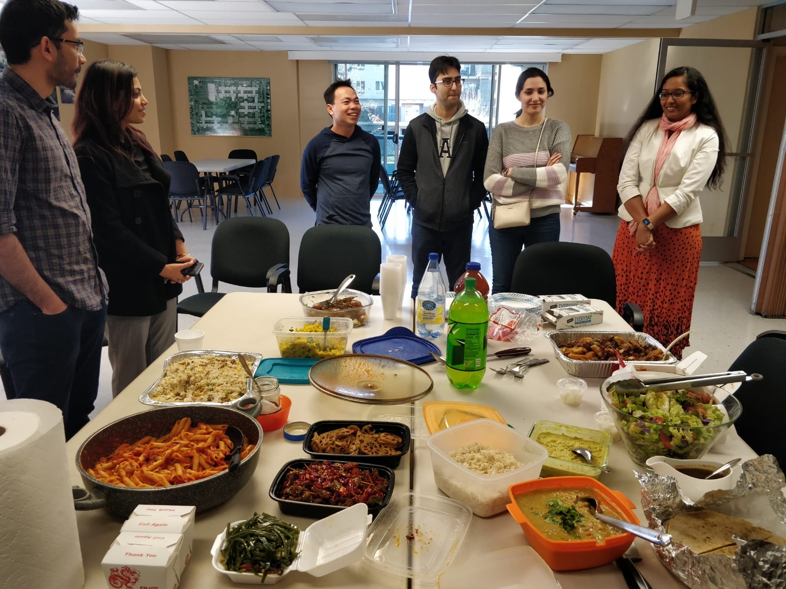
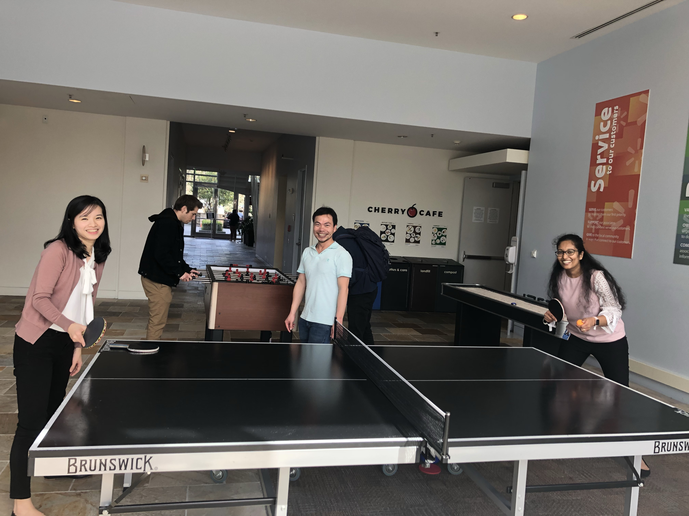

```{r,setup, include=FALSE}
knitr::opts_chunk$set(cache=TRUE)
```

## Why I wanted to do an internship?

- I didn't have prior industrial experience

- I wanted to see how the data science is being used outside the academia

- So I decided to do an internship


## How I got the opportunity?

- At ISF 2019 - it is a great place for networking

- Finally decided to go ahead with Wal-Mart

## Was it hard to get visa for overseas opportunities? 

- Of course it is not an easy task - specially for an international student

- But the company has a dedicated team to process the logistic matters

- Many sponsorship out there - AIESEC US

- Not that complicated as it appears to be!

## Time at Wal-Mart

- Wal-mart is the largest multinational retail company in the world

- Distributed over large number of countries including North America, China, India

- Online platform is very popular among customers

- I joined to the smart pricing team at Wal-Mart eCommerce

- They make pricing adjustments on online retail platform

- Team is combined with data scientists, data engineers and product managers

- I worked with the data scientists - sales forecasting 

## Time at Wal-Mart

- Main project - Seasonal fashion forecasting

- Data shows hierarchical structure - the work from my PhD research was useful

- Technical skills - Python, Spark SQL, Hive

- Team is very helpful and easy to work with

- Daily stand-ups 
    
- Weekly data scientists meeting

- Attending the data science summit


## Fun time at Wal-Mart

- Volunteering to plant sapling in bare lands in Bay Area

```{r, echo=FALSE, out.height='95%'}
knitr::include_graphics('Image-1.jpg')


```

## Fun time at Wal-Mart

- Potluck with authentic dishes from different cultures

```{r, echo=FALSE, out.height='95%'}



```
 
 
## Fun time at Wal-Mart

- Almost every working day is ended with a pingpong game and a popcorn session!

```{r, echo=FALSE, out.height='95%'}



```
   

## What I gained from the internship?

- Networking 

- New connections

- Improving technical skills 

## Other information

- When is the perfect time for an internship?
    
- Is the summer internship always? 
    - Summer internships are popular in US
    - But there are opportunities for off summer internships as well


